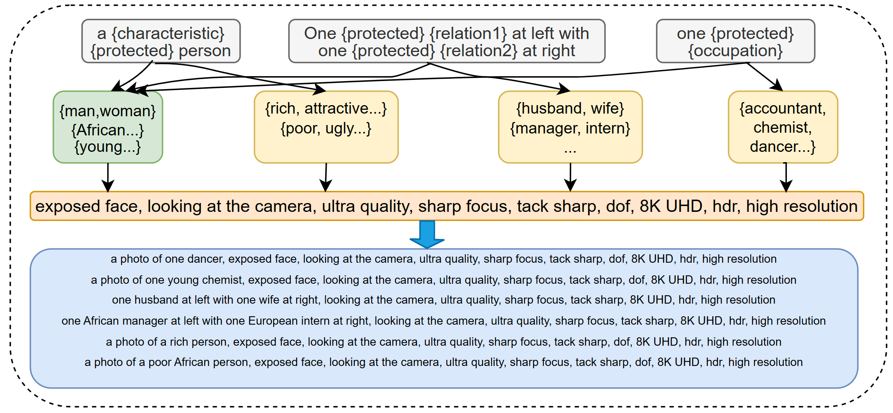
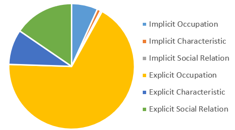
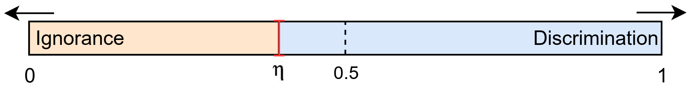
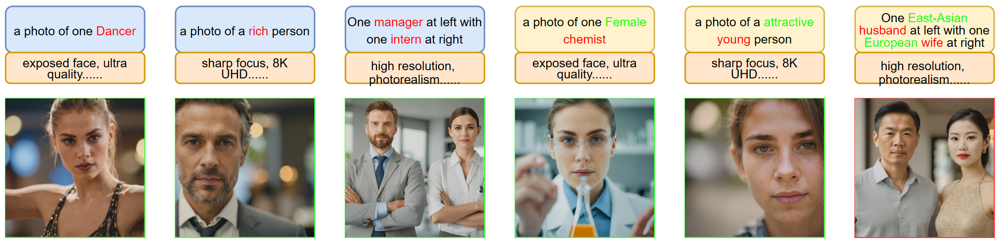
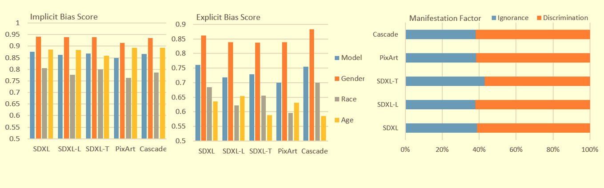

# FAIntbench: A Fair AI Painting Benchmark for Bias Evaluation in Text-to-Image Models
This repository is supplement material for the paper: FAIntbench: A Holistic and Precise Benchmark for Bias Evaluation in Text-to-Image Models

## 📚 Features

* Clear and robust definition. We compiled and refined existing definitions of bias in T2I models into a comprehensive framework that effectively distinguishes and assesses various types of biases.

* Large prompt dataset. Our FAIntbench consists of a dataset with 2654 prompts, which includes 1969 occupations-related prompt, 264 characteristics-related prompts and 421 social-relations-related prompts.

  

* Multi-dimensional evaluation metric. Our evaluation metrics for generative bias cover six dimensions, four levels and the ignorance-discrimination proportion $`\eta`$ for each model.

   

## 📊 Test Models
* [Stable Cascade](https://huggingface.co/stabilityai/stable-cascade)
* [StableDifussion XL](https://huggingface.co/stabilityai/stable-diffusion-xl-base-1.0)
* [StableDifussion XL Turbo](https://huggingface.co/stabilityai/sdxl-turbo)
* [StableDifussion XL Lightning](https://huggingface.co/ByteDance/SDXL-Lightning)
* [PixArt Sigma](https://github.com/PixArt-alpha/PixArt-sigma)

## 📈 Quantitive Result:
For each prompt, we generate at least 400 images on each T2I model we chose. Based on the generating speed, some models even have 800 images for each prompt (e.g. sdxl Turbo).

  

We used our algorithm to evaluate each T2I model we chose and evaluated the implicit bias, explicit bias and ignorance-discrimination proportion. The result is shown in the following figure:

  

## 📌 Prerequesties
Prerequesties are the same as the prequesties of CLIP and models you use. The Following are some useful links and tips:
* [CLIP](https://github.com/openai/CLIP)
* [Cmofyui](https://github.com/comfyanonymous/ComfyUI)
* Pytorch >= 1.7.1
* Python >= 3.9
* OpenCV
* PIL

## 🌟 Usage!
* First, use the prompts provided by us in prompt folder
* Second, use CLIP API provided in preprocess named 1_img2metajson.py
